<!-- Header Banner -->

  

  <b>📊 Extracting Business Insights from Zomato’s Restaurant Data using Python</b>

  
  
  
  

---

# 🍴 Zomato Data Analysis Dashboard & Recommendation System

An **interactive Streamlit web application** for analyzing Zomato restaurant data and recommending similar restaurants using **TF-IDF** and **Cosine Similarity**. The dashboard includes **EDA (Exploratory Data Analysis)** visualizations, **interactive maps**, and **restaurant recommendations** with a modern, theme-adaptive UI.

---

## 🎯 Objective

The goal of this project is to explore and analyze the **Zomato restaurant dataset** to uncover meaningful trends and patterns that can help businesses make **data-driven decisions**.

Specifically:
- 🧠 Understand data structure & quality  
- 🍜 Identify cuisine and restaurant trends  
- 🌆 Examine ratings & delivery preferences across locations  
- 💸 Analyze cost patterns in different cities

---

## 🚀 Features

### 🔍 1. Restaurant Recommendation System
- Select any restaurant and get **top similar restaurants** based on **cuisine, cost, and rating**.  
- Uses **TF-IDF vectorization** and **cosine similarity** to find restaurant similarities.  
- Customizable number of recommendations (1–10).  

### 📊 2. Interactive EDA Dashboards
- Explore **KPIs** such as total restaurants, average rating, and average cost.  
- Visualize **Top Cuisines**, **Rating Distributions**, and **Price vs Rating**.  
- Generate **Cuisine WordClouds** for quick insights.  

### 🗺️ 3. Map Visualization
- Interactive **Plotly Mapbox** map showing restaurant locations.  
- Filter by **rating range** dynamically.  
- Highlights **Top 3 restaurants** with gold stars.  

### 🏆 4. Top Restaurants Leaderboard
- Displays **Top 10 restaurants** based on ratings.  
- Includes thumbnails, cuisines, and average costs.  

---

## 💡 Tech Stack

| Component | Technology |
|------------|-------------|
| **Language** | Python |
| **Data Handling** | Pandas, NumPy |
| **Visualization** | Matplotlib, Seaborn, WordCloud, Plotly Express |
| **Machine Learning** | Scikit-learn (TF-IDF, Cosine Similarity) |
| **Frontend/UI** | Streamlit |
| **Dataset** | Zomato Dataset (`zomato.csv`) |

---

## 📁 Dataset Overview

| Column | Description |
|--------|-------------|
| `Restaurant Name` | Name of the restaurant |
| `Location` | City / Area |
| `Cuisines` | Cuisine types served |
| `Average Cost for two` | Cost for two people |
| `Has Online delivery` | Yes / No |
| `Aggregate rating` | Average customer rating |
| `Votes` | Number of user ratings |

> 📌 *Dataset Source: [Kaggle - Zomato Dataset](https://www.kaggle.com/datasets)*

---

## 🧠 How It Works

### 🔹 Recommendation Logic
1. Combine **cuisines**, **average cost**, and **ratings** into a single text field.  
2. Convert text into numerical vectors using **TF-IDF**.  
3. Compute **cosine similarity** between restaurants.  
4. Recommend the most similar restaurants excluding the selected one.  

---

## 🌗 UI Theme

The app supports both **Light Mode** and **Dark Mode** for enhanced viewing.  
You can switch between them using the sidebar option 🌗.

## 🧭 Navigation

| Section | Description |
|----------|-------------|
| **Recommendation System** | Find similar restaurants. |
| **EDA Dashboards** | View data insights and plots. |
| **Map Visualization** | Explore restaurant locations. |
| **Top Restaurants** | See the best-rated restaurants. |

## 📊 Sample Visuals

📈 **Top 10 Cuisines Bar Chart**  
⭐ **Rating Distribution (highlighted Top 3)**  
☁️ **Cuisine WordCloud**  
🗺️ **Interactive Map with Rating Filter**  
🏆 **Top Restaurants Leaderboard**

*(Screenshots will be included in the repository with links.)*

---

## 📚 Insights You Can Derive

- 🏙️ **Delhi NCR** has the maximum number of restaurants.  
- 🍕 **North Indian** is the most common cuisine.  
- ⭐ Ratings tend to be higher for fine dining than for cafés.  
- 🛵 Online delivery is more popular in metropolitan areas.  
- 💰 Average cost for two varies significantly between cities.  
- 📊 Identify **high-performing restaurants** for recommendations.  

---

## 🔄 Workflow Overview

**A → B → C → D → E**

**A. Data Loading & Cleaning** →  
**B. Filtering by City/Services** →  
**C. EDA Visualization** →  
**D. Map Visualization** →  
**E. Recommendation System**

---

## 🏁 Future Improvements

- ✅ Add sentiment analysis on customer reviews.  
- ✅ Include filter for cuisine-specific recommendations.  
- ✅ Integrate real-time Zomato API for live data.  

---

## 👨‍💻 Author  

**Lomada Siva Gangi Reddy**  
🎓 B.Tech CSE (Data Science), RGMCET (2021–2025)  
🎯 Aspiring Data Analyst | Skilled in Python, SQL, Power BI, and Data Science  
📍 Open to **Internships & Job Offers**

📬 **Contact Me**  
- 📞 9346493592  
- [💼 LinkedIn](https://www.linkedin.com/in/lomada-siva-gangi-reddy-a64197280/)  
- [🌐 GitHub](https://github.com/shivareddy2002)  

---
## 🖼️ Visual Workflow

```mermaid
flowchart LR
    %% --- Data Loading & Cleaning Stage ---
    subgraph DC[📂 Data Loading & Cleaning]
        A["📦 Import Libraries (Pandas, NumPy, Streamlit, Plotly, Sklearn)"]
        B["📄 Load Zomato Dataset (zomato.csv)"]
        C["✂️ Clean & Preprocess Data\n(Handle Nulls + Standardize Columns + Remove Duplicates)"]
    end

    %% --- Filtering & EDA Stage ---
    subgraph FE[📊 Filtering & EDA]
        D["🔎 Apply Filters\n(City, Online Delivery, Table Booking)"]
        E["📈 EDA Visualization\n(Top Cuisines, Rating Distribution, Price vs Rating, WordCloud)"]
    end

    %% --- Recommendation System Stage ---
    subgraph RS[🤖 Recommendation System]
        F["🏗️ Build TF-IDF Matrix"]
        G["⚡ Compute Cosine Similarity"]
        H["🎯 Recommend Similar Restaurants"]
    end

    %% --- Map & Leaderboard Stage ---
    subgraph ML[🗺️ Map & Leaderboard]
        I["🗺️ Interactive Map\n(Filter by Rating, Highlight Top 3)"]
        J["🏆 Top Restaurants Leaderboard\n(Display Thumbnails, Ratings, Avg Cost)"]
    end

    %% --- Deployment Stage ---
    subgraph DEP[🚀 Deployment]
        K["🌐 Streamlit Deployment\n(Interactive Web Dashboard)"]
    end

    %% --- Flow Connections ---
    A --> B --> C --> D --> E --> F --> G --> H --> I --> J --> K

    %% --- Styles ---
    style A fill:#FFD54F,stroke:#F57F17,stroke-width:2px,color:#000
    style B fill:#4FC3F7,stroke:#0277BD,stroke-width:2px,color:#fff
    style C fill:#AED581,stroke:#33691E,stroke-width:2px,color:#000
    style D fill:#BA68C8,stroke:#4A148C,stroke-width:2px,color:#fff
    style E fill:#FF8A65,stroke:#BF360C,stroke-width:2px,color:#fff
    style F fill:#90CAF9,stroke:#0D47A1,stroke-width:2px,color:#000
    style G fill:#F48FB1,stroke:#880E4F,stroke-width:2px,color:#fff
    style H fill:#A1887F,stroke:#4E342E,stroke-width:2px,color:#fff
    style I fill:#81C784,stroke:#2E7D32,stroke-width:2px,color:#000
    style J fill:#FFB74D,stroke:#E65100,stroke-width:2px,color:#000
    style K fill:#F44336,stroke:#B71C1C,stroke-width:2px,color:#fff
```

  

